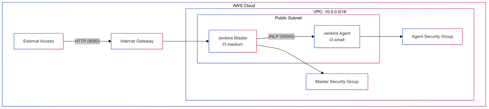

# 🚀 Jenkins Fundamentals: Enterprise CI/CD Infrastructure Implementation

[](https://github.com/TheToriqul/jenkins-fundamentals)
[](https://github.com/TheToriqul/jenkins-fundamentals/stargazers)


## 📋 Project Overview

This repository provides a comprehensive Jenkins CI/CD implementation, covering the entire setup process from installation to configuring a distributed build environment. It demonstrates enterprise-grade automation practices, including automated server provisioning, job management, and agent configuration using AWS infrastructure. The implementation features custom installation scripts with robust error handling, automated port configuration, and secure communication between master and agent nodes. Designed for scalability and reliability, this project serves as a practical reference for setting up a production-ready Jenkins environment.

## 🎯 Key Objectives

- Set up a robust Jenkins server with automated installation and configuration
- Implement intelligent port management with conflict resolution
- Create and manage parameterized Jenkins jobs with scheduling
- Configure distributed builds using Jenkins agents over SSH
- Deploy secure AWS infrastructure using Pulumi
- Implement proper security measures including SSH keys and security groups
- Establish automated backup and maintenance procedures

## 🏗️ Project Architecture

<figure >
  <p align="center">
      
      <p align="center">Jenkins Distributed Build Architecture</p> 
  </p>
</figure>

This distributed Jenkins infrastructure deploys a master node for orchestration and agent node for build execution within a secure AWS VPC. The master handles job management and scheduling while the agent executes builds, communicating securely via JNLP protocol with dedicated security groups controlling access to each component.


## 💻 Technical Stack

<details>
<summary>Infrastructure Components</summary>

- **VPC Configuration**
  - CIDR: 10.0.0.0/16
  - Public Subnet with Internet Gateway
  - DNS hostnames enabled
  - Custom route tables

- **Security Groups**
  - Master Node:
    - SSH (22) - External Access
    - Jenkins Web (8081) - External Access
    - JNLP (50000) - Internal VPC Access
  - Agent Node:
    - SSH (22) - External Access
    - JNLP (50000) - Internal VPC Access

- **EC2 Instances**
  - Master: t3.medium, Ubuntu 20.04
  - Agent: t3.small, Ubuntu 20.04
</details>

<details>
<summary>Software Stack</summary>

- **Operating System**
  - Ubuntu 20.04 LTS
  - OpenJDK 17 JRE

- **Core Services**
  - Jenkins LTS
  - Python 3.8+
  - AWS CLI
  - Pulumi

- **Jenkins Components**
  - Suggested plugins suite
  - Job scheduling system
  - Workspace management
  - Build parameterization
</details>

## 🚀 Getting Started

<details>
<summary>🐳 Prerequisites</summary>

- AWS account with administrative access
- Ubuntu 20.04 server
- Python 3.8+ with venv
- Basic understanding of:
  - Linux command line
  - AWS services
  - Jenkins concepts
  - Network configuration
</details>

<details>
<summary>⚙️ Infrastructure Setup</summary>

1. Prepare Python environment:
   ```bash
   sudo apt install python3.8-venv -y
   python3 -m venv venv
   source venv/bin/activate
   ```

2. Set up Pulumi project:
   ```bash
   mkdir jenkins-agent-aws && cd jenkins-agent-aws
   pulumi new aws-python
   ```

3. Deploy AWS infrastructure:
   ```bash
   pulumi up --yes
   ```

4. Configure SSH access:
   ```bash
   cd ~/.ssh/
   aws ec2 create-key-pair --key-name jenkins_cluster \
       --output text --query 'KeyMaterial' > jenkins_cluster.id_rsa
   chmod 400 jenkins_cluster.id_rsa
   ```
</details>

<details>
<summary>🔧 Jenkins Installation</summary>

1. Run installation script:
   ```bash
   chmod +x jenkins-install.sh
   sudo ./jenkins-install.sh
   ```

2. Verify port configuration:
   ```bash
   sudo netstat -tuln | grep 8081
   ```

3. Access initial setup:
   ```bash
   sudo cat /var/lib/jenkins/secrets/initialAdminPassword
   ```

4. Complete web setup:
   - Install suggested plugins
   - Create admin user
   - Configure instance
</details>

<details>
<summary>🎮 Job Configuration</summary>

1. Create Freestyle Project:
   - New Item → Freestyle project
   - Configure Source Code Management
   - Add build steps
   - Set up build triggers

2. Configure Build Parameters:
   - String parameters
   - Choice parameters
   - File parameters

3. Schedule Builds:
   - Configure build triggers
   - Set up cron schedules
   - Configure polling

4. Manage Workspace:
   - Set custom workspace
   - Clean workspace
   - Archive artifacts
</details>

<details>
<summary>🔄 Agent Setup</summary>

1. Prepare Agent Node:
   - Generate SSH keys
   - Configure authorized_keys
   - Create Jenkins directory

2. Configure in Jenkins UI:
   - Add new node
   - Configure SSH authentication
   - Set up work directory
   - Test connection

3. Verify Setup:
   - Run test job on agent
   - Monitor agent logs
   - Check connectivity

<figure >
  <p align="center">
      
      <p align="center">Agent Setup Architecture || Credit: Poridhi.io</p>
  </p>
</figure>

</details>

## 💡 Key Learnings

### Technical Mastery:
1. Jenkins server configuration and maintenance
2. AWS infrastructure deployment with Pulumi
3. Network security and SSH key management
4. Job scheduling and parameterization
5. Distributed build architecture

### Professional Development:
1. Infrastructure as Code practices
2. Security-first approach
3. Automation scripting
4. System monitoring
5. Documentation best practices

### 🔄 Future Enhancements

<details>
<summary>View Planned Improvements</summary>

1. Docker container integration
2. Pipeline as Code implementation
3. Multi-agent configuration
4. Automated backup system
5. Monitoring and alerting
6. High availability setup
</details>

## 🙌 Contribution

Contributions are welcome! Feel free to [open an issue](https://github.com/TheToriqul/jenkins-fundamentals/issues) or submit a [pull request](https://github.com/TheToriqul/jenkins-fundamentals/pulls).

## 📧 Connect with Me

- 📧 Email: toriqul.int@gmail.com
- 🌐 LinkedIn: [@TheToriqul](https://www.linkedin.com/in/thetoriqul/)
- 🐙 GitHub: [@TheToriqul](https://github.com/TheToriqul)
- 🌍 Portfolio: [TheToriqul.com](https://thetoriqul.com)

## 👏 Acknowledgments

- [Poridhi for providing comprehensive labs and inspiring this project](https://devops.poridhi.io/)
- Jenkins community for documentation
- AWS for cloud infrastructure
- Open source community

---

Thank you for exploring this Jenkins infrastructure project! Let's connect and discuss CI/CD beyond! 🚀